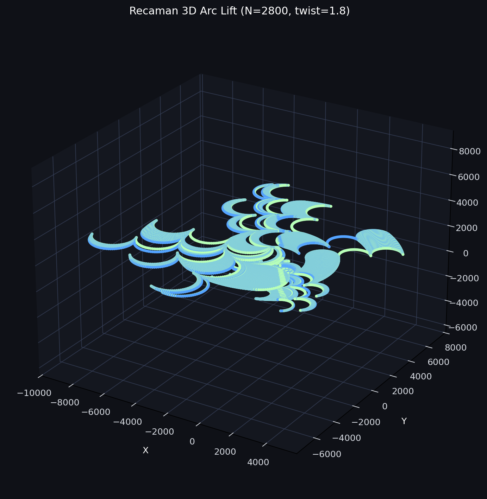

# Recaman Obstructions

This repo studies the obstruction structure around the Recaman sequence from three angles:

1. value-side obstruction classification on a curated list of missing / obstructed integers,
2. process-side validation of the Recaman obstruction bit itself,
3. geometric / phase-space visualization of the trajectory.

The goal is not just to get high classification scores. The goal is to find signals that survive honest temporal validation and remain interpretable in terms of the Recaman rule.

The strongest current process-side conclusion is simple:

- the classic `Theta_3` wheel is falsified as a predictor of the real obstruction bit,
- the previous obstruction bit `b_{n-1}` is the dominant predictive state,
- the observed stream is best described as near-perfect alternation plus rare phase-slip defects.

That is a stronger empirical statement than the geometric story at the moment. The geometric / phase-slip framing remains useful as an exploratory language for where the rare defects occur, but the local closure problem for those defect locations is still open.
## 3D Snapshot

Current 3D phase-space render from `scripts/recaman_phase_space_3d.py`:



## Definitions

### What is an "obstruction" here?

The root file [`obstructions.txt`](obstructions.txt) is a list of integers and integer ranges treated as positive examples on the value side. In this repo, those are the candidate "obstructed" or "missing" values we are trying to distinguish from matched non-obstruction controls.

There are two different labels in this project, and they should not be confused:

- Value-side label: `y = 1` means "this integer is in the obstruction list"; `y = 0` means "matched control integer not in that list".
- Process-side label: `b_n = 1` means the Recaman down-move was blocked at step `n`, so the sequence was forced to move up. `b_n = 0` means the down-move was free.

In code, the process-side definition is explicit in [`scripts/recaman_wheel_validator.py`](scripts/recaman_wheel_validator.py): `b[n] = 1` is "blocked/up", `b[n] = 0` is "free/down".

### What do the `194,358` pairs mean?

The random-matrix search expands the ranges in `obstructions.txt` into individual integers. After expansion, the current saved run contains:

- `194,358` positive integers from the obstruction list,
- `194,358` controls sampled outside that list,
- `1` matched control per positive,
- controls matched by digit length.

So the "194k pairs" means a balanced binary dataset of `194,358` positives versus `194,358` matched random controls, used by [`scripts/321_210_randmat.py`](scripts/321_210_randmat.py) and saved in [`outputs/best_obstructions_random_20260512_172100.json`](outputs/best_obstructions_random_20260512_172100.json).

## Scope And Goals

The repo is trying to answer four concrete questions:

1. Can obstruction-list values be separated from matched controls by simple arithmetic / digit / residue features?
2. Can obstruction events be modeled honestly when temporal leakage is removed?
3. Is the classic `Theta_3` wheel actually predictive of the real Recaman obstruction bit?
4. What geometric structure shows up when the sequence is embedded in 3D phase space?

## Best Results First

### 1. Strongest process-side result: previous-bit conditioning dominates, and the `Theta_3` wheel is falsified

From [`outputs/recaman_wheel_results.json`](outputs/recaman_wheel_results.json):

- `q_210 = 0.500007`
- `q_321 = 0.499996`
- `|Δq| = 0.000011`
- `q(prev=0) = 0.998919`
- `q(prev=1) = 0.001087`
- `|q(prev=0) - q(prev=1)| = 0.997832`
- phase-slip rate `P(b_n = b_{n-1}) = 0.001084`
- mean alternating run length `≈ 415`

Interpretation:

- As a predictive state for the real obstruction bit, the two-state `Theta_3` wheel fails.
- As a first-order descriptive model, the previous bit almost completely determines the next one.
- The obstruction stream is therefore best summarised as "alternation with rare defects", not as a useful `Theta_3` Markov wheel.

This does **not** mean the phase-slip locations are solved. It means the empirical closure problem has sharpened: the right thing to model is where the rare defects occur, not whether the symbolic wheel flips.

### 2. Best trustworthy value-side result: dataset `D` reaches mean AUC `0.7586`

From [`outputs/version_c_obstructions_results.json`](outputs/version_c_obstructions_results.json), using:

- forward-chaining CV,
- `purge_contexts = 1`,
- time-local control generation,
- one matched control per positive context.

Dataset `D` scores:

- fold AUCs: `0.7884, 0.7569, 0.7863, 0.7618, 0.6997`
- mean AUC: `0.7586`

This is currently the most meaningful value-side score in the repo because it survives the leakage fixes and uses the hardest, most local task formulation.

### 3. Random-matrix search gives moderate value-side signal, but it is not the main process-side explanation

From [`outputs/best_obstructions_random_20260512_172100.json`](outputs/best_obstructions_random_20260512_172100.json):

- positives: `194,358`
- controls: `194,358`
- feature dimension: `42`
- best linear-code AUC: `0.5994`
- random-forest CV mean AUC: `0.6633`

This is weaker than dataset `D`, but it is also a cleaner baseline than the very high `A/B/C` endpoint scores below.

It also answers a different question from the wheel analysis. The `42`-feature search is about value-side obstruction-list membership. It does **not** explain the real obstruction bit process nearly as well as the previous-bit / phase-slip picture does.

### 4. High AUC on `A/B/C`, but these are easier tasks

Current `Version C` endpoint / anchor tasks score:

- Dataset `A`: mean AUC `0.9961`
- Dataset `B`: mean AUC `0.9964`
- Dataset `C`: mean AUC `0.9944`

These numbers are real outputs, but they should not be treated as the main scientific result. They are much easier discrimination problems than `D`.

## Why `0.7586` Is Better Than `0.99`

This is the key interpretation point in the repo.

The `0.99+` scores on `A/B/C` are high because those tasks ask an easier question: given a known obstruction event, can we separate its start or end anchor from a broad matched random control? That setup still contains strong structural cues in the value itself and in coarse event geometry.

Dataset `D` is harder and more honest:

- it predicts gap dynamics rather than just endpoint identity,
- it uses local matched controls built from the same event context,
- it is evaluated with forward CV instead of train-on-future blocked folds,
- the earlier future-information leakage in control generation was removed.

So `0.7586` matters more scientifically than `0.996` because it is closer to the actual closure problem: can local state predict what kind of obstruction pattern happens next, not just identify a conspicuous endpoint after the fact?

## Approaches Taken

### 1. Random matched-control feature search

[`scripts/321_210_randmat.py`](scripts/321_210_randmat.py) expands the obstruction list into individual integers, builds a 42-dimensional feature vector per integer, samples matched random controls, then searches over random linear projections and reranks candidates with random-forest CV.

This is the source of the `194,358` positive / `194,358` control dataset and the `0.6633` RF-CV result.

### 2. Event-structured "Version C" modeling

[`scripts/321_210_version_c.py`](scripts/321_210_version_c.py) compresses the obstruction list into event intervals and builds four datasets:

- `A`: singleton obstruction starts,
- `B`: range starts,
- `C`: range ends,
- `D`: gap dynamics between successive events.

The current version uses:

- forward CV by default,
- a purge window between train and test blocks,
- time-local visible blocked points only,
- matched controls per event context.

This is the main leakage-reduced value-side pipeline.

### 3. Wheel / phase-slip validation

[`scripts/recaman_wheel_validator.py`](scripts/recaman_wheel_validator.py) runs the true Recaman generator and tests whether the symbolic wheel state predicts the real obstruction bit.

Main outputs:

- `Theta_3` wheel separation is essentially zero,
- bit-history separation is extremely strong,
- measured phase-slip rate is `0.001084`,
- logistic 4-feature closure accuracy is `0.98575`.

The right high-level reading is:

- the `Theta_3` wheel adds almost nothing,
- `b_{n-1}` carries the dominant signal,
- the remaining unsolved piece is the state dependence of the rare phase-slip events.

### 4. 3D phase-space exploration

[`scripts/recaman_phase_space_3d.py`](scripts/recaman_phase_space_3d.py) generates delay embeddings, spatiotemporal embeddings, and lifted-arc 3D renders of the Recaman trajectory. This part is exploratory and geometric rather than a predictive benchmark. At present the geometry is best treated as a way to generate hypotheses about phase-slip localization, not as a closed explanation of the process.

## Current Result Files

- [`outputs/version_c_obstructions_results.json`](outputs/version_c_obstructions_results.json)
- [`outputs/recaman_wheel_results.json`](outputs/recaman_wheel_results.json)
- [`outputs/best_obstructions_random_20260512_172100.json`](outputs/best_obstructions_random_20260512_172100.json)
- [`outputs/recaman_phase_arc_readme.png`](outputs/recaman_phase_arc_readme.png)

## Dataset Summary

From the current `Version C` run:

- total events: `3102`
- singleton events: `2535`
- range events: `567`
- range length max: `368,058`
- event start span: `930,058` to `4,293,242,951`

## Repo Layout

```text
.
|-- README.md
|-- obstructions.txt
|-- scripts/
|-- outputs/
`-- supporting_docs/
```

### Main scripts

- `scripts/321_210_randmat.py`: random matched-control search on expanded obstruction integers.
- `scripts/321_210_version_c.py`: event-based obstruction modeling with forward CV.
- `scripts/recaman_wheel_validator.py`: long-run wheel and phase-slip validation.
- `scripts/recaman_wheel_honest.py`: honest wheel null comparison.
- `scripts/recaman_modm_scan.py`: modular-state scan for obstruction separation.
- `scripts/recaman_heldout.py`: held-out checks for candidate predictors.
- `scripts/recaman_phase_space_3d.py`: 3D phase-space plots.
- `scripts/recaman_seq_distribution.py`: large-sample distribution histogram.

## Typical Usage

Run from the repo root.

```powershell
python .\scripts\321_210_version_c.py --input-file .\obstructions.txt --datasets ABCD --save-json .\outputs\version_c_obstructions_results.json
python .\scripts\321_210_randmat.py --input-file .\obstructions.txt --controls-per-positive 1 --save-best-file .\outputs\best_obstructions_random.json
python .\scripts\recaman_wheel_validator.py
python .\scripts\recaman_phase_space_3d.py --steps 2800 --mode delay --tau 2 --save .\outputs\recaman_phase_delay.png
python .\scripts\recaman_phase_space_3d.py --steps 2800 --mode arc-lift --twist 1.8 --save .\outputs\recaman_phase_arc.png
```

## Supporting Docs

- [`supporting_docs/twistor_splitor_recaman_dossier.pdf`](supporting_docs/twistor_splitor_recaman_dossier.pdf)
- [`supporting_docs/recaman_final_math.md`](supporting_docs/recaman_final_math.md)
- [`supporting_docs/recaman_final_math.pdf`](supporting_docs/recaman_final_math.pdf)
- [`supporting_docs/Recaman_Wheel_Validation.docx`](supporting_docs/Recaman_Wheel_Validation.docx)

## Further Work

1. Replace broad random controls in `A/B/C` with tighter local controls so those tasks measure genuine local prediction instead of easy endpoint separability.
2. Ablate raw anchor-value features to see how much of the `0.99+` signal is coming from trivial value identity.
3. Push the `D` pipeline further: richer local gap features, better density summaries, and stricter temporal purging.
4. Reconcile the process-side phase-slip picture with the value-side obstruction models.
5. Test whether the moderate `0.66` random-matrix signal survives under stronger locality constraints and alternative control matching.
6. Add a single experiment index file so each saved JSON can be traced to the exact command and code version that produced it.
